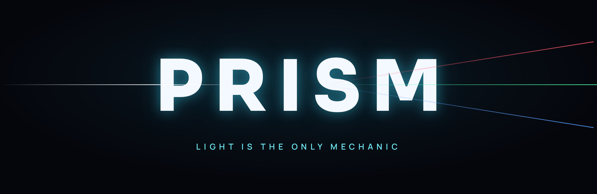
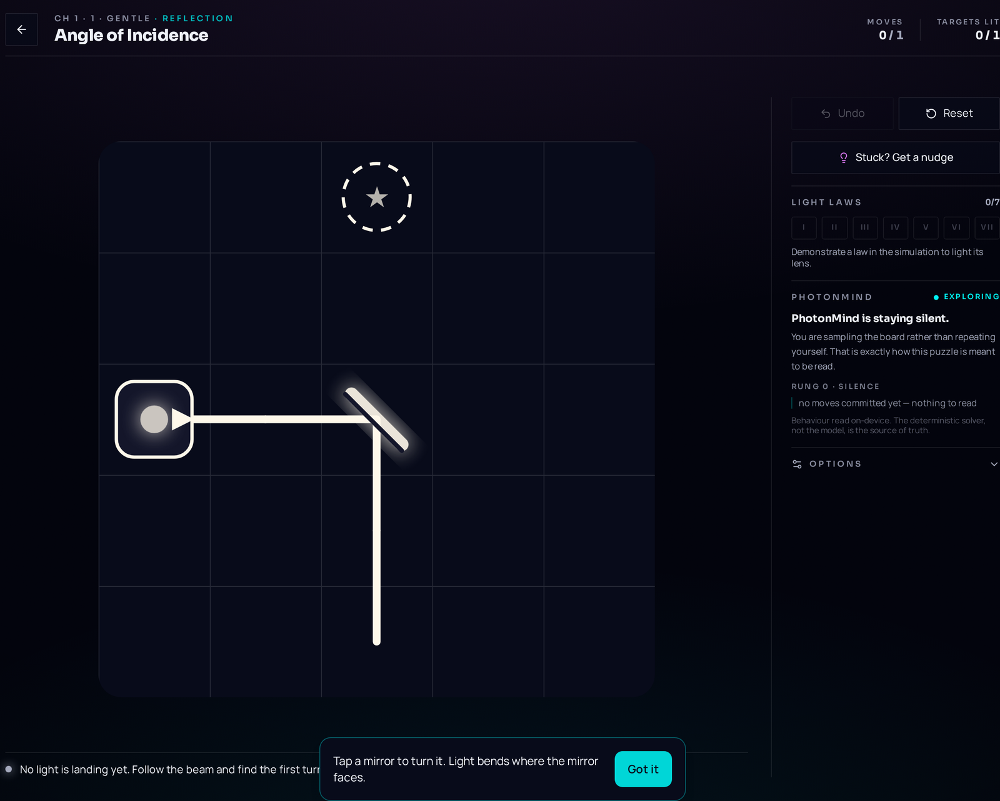
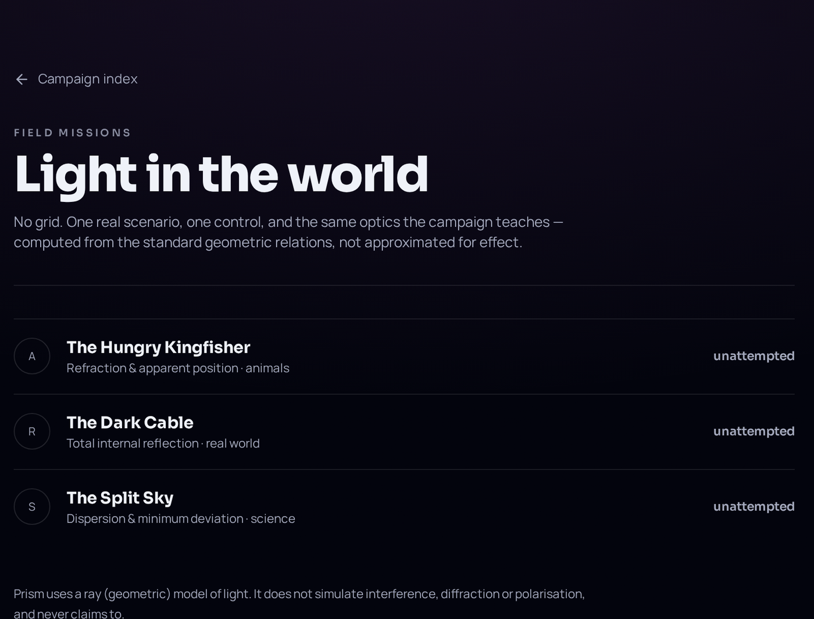
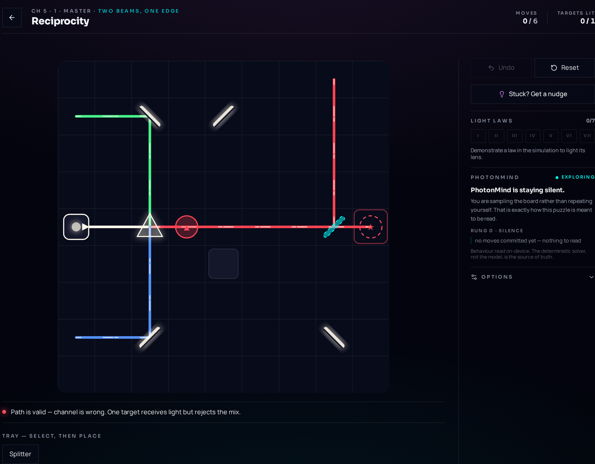
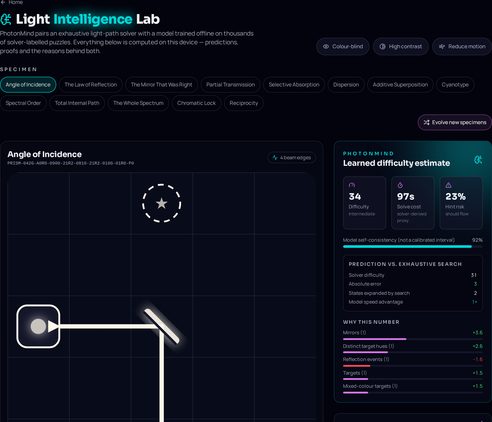

<div align="center">



**A light-refraction logic puzzle.** You place and turn mirrors, splitters, prisms and colour
filters until every target burns the exact colour it asks for — on a deterministic optical
simulation, with no lives, no timers and no luck.

</div>

---



## What Prism is

Thirteen hand-built campaign puzzles, three field missions and a set of laboratory tools, built
around one rule: **light is the only mechanic.** Every board is solved by reasoning about where a
beam goes and what colour it carries when it arrives — nothing else.

The beam engine is deterministic and exhaustively searchable, so every puzzle ships with a proven
optimal solution. Par values are not guesses; they are the shortest solutions a breadth-first
search could find.

### How it works

| Element | Behaviour |
| --- | --- |
| Emitter | Emits a beam of a fixed colour. |
| Mirror | Turns a beam 90°. |
| Prism | Separates white light into red, green and blue — or recombines them. |
| Splitter | Sends a beam down two paths at once, and merges beams that arrive together. |
| Filter | Transmits one channel and absorbs the rest. |
| Target | Lights only when the arriving light matches its colour exactly. |

Colour is stored as three channels. Two beams meeting combine channel by channel, so red and green
arriving at the same cell read as yellow — the same way additive light actually behaves.

### The loop

```
Observe  →  Experiment  →  Route light  →  Discover  →  Solve  →  Learn
```

Nothing pauses to lecture you. A phenomenon has to happen on your board before the game says a word
about it.

---

## What makes it Prism

**Ghost what-if preview.** Hovering a piece shows the beam the move *would* produce, ghosted over
the current one. You can think before you commit, and see why an idea fails without losing the state
you had.

**Living rulebook.** Seven optical laws sit locked in the side rail. Each one unlocks only when the
simulation detects you causing that phenomenon — reflection, dispersion, additive mixing, total
internal reflection and the rest.

**PhotonMind.** A small learned model that estimates puzzle difficulty and shows its own arithmetic,
next to the exhaustive solver that remains the ground truth.

**The Master Trial.** One late puzzle that deliberately breaks an assumption the campaign spent four
chapters building.

**One level, one idea.** Each puzzle closes with a single named concept, one accurate sentence, and
an attribution where the history genuinely supports one — Ibn al-Haytham on reflection, Newton on
dispersion, Helmholtz on reciprocity.

**Field missions.** Three scenarios with no grid at all: aiming through the water surface for a
kingfisher, guiding light down a bent cable, and finding minimum deviation through a prism. The
answers are computed from the standard geometric relations, not approximated for effect.



---

## The Master Trial — Optical Reciprocity



**What you were taught.** For four chapters a splitter is a device that takes one beam and makes two.

**What you expect.** To light the final target, you look for a beam to divide.

**What the trial breaks.** The board gives you three separate coloured emitters and one target that
wants all three channels at once. Splitting anything makes the problem worse.

**What you discover.** Light paths run in both directions. Sent backwards through the same junction,
a splitter *combines*. The device never changed — the assumption did.

---

## PhotonMind

PhotonMind is a distillation experiment, not an oracle. Read it that way.

- **What it predicts.** A difficulty score, a solve-cost estimate and a hint-risk probability, from
  a 16-dimensional description of the board (piece counts, colour variety, branching, and so on).
- **What the labels are.** Every training label came from the exhaustive solver — search depth,
  states expanded, branching. **Solver-derived difficulty is not human-labelled difficulty**, and the
  interface says so wherever a number appears. There is no human playtest dataset behind these
  models.
- **Baselines.** Ridge regression is compared against predicting the corpus mean and against a
  naive piece-count heuristic; the hint classifier is compared against the majority class. Both the
  model error and the baseline errors are printed in the Intelligence Lab so the lift is checkable.
- **Ground truth stays with the solver.** Where a claim must be correct — is this board solvable, is
  this par honest — the BFS solver answers, not the model. The model only estimates.
- **Explainability.** Every prediction ships with its per-feature contributions, signed and ranked,
  so the number can be audited rather than trusted.
- **Limitations.** Linear models on a synthetic corpus. Boards far outside the training distribution
  are extrapolation, and the interface labels the accompanying figure *model self-consistency* — it
  is not a calibrated confidence interval.



---

## Architecture

```
React 19  ·  TanStack Start + TanStack Router
        │
Game state  (React stores, localStorage persistence)
        │
Deterministic beam engine        src/game/engine.ts
        │
Exhaustive BFS solver / analysis src/game/analysis.ts
        │
PhotonMind  features → frozen weights → explanations
        │
UI: board, rulebook, discovery journal, replay, field missions
```

Rendering is SVG with Tailwind v4 tokens; motion is Motion for React. Progress, streaks and
preferences live in localStorage behind defensive parsers. The managed Postgres backend is used only
for optional accounts — the entire game is playable signed out and offline.

<details>
<summary><strong>Project structure</strong></summary>

```
src/
├── game/            engine, levels, analysis, discoveries, missions, photonmind
├── components/      game board, instrument chrome, missions, photonmind panels
├── routes/          file-based routes (campaign, missions, labs, studio, profile)
├── lib/             utilities, MCP tools, auth middleware
├── integrations/    backend client
└── styles.css       Tailwind v4 theme tokens
scripts/             level validation, model training
docs/                assets and design contracts
```

Worth reading first: `src/game/engine.ts` (the simulation), `src/game/analysis.ts` (the solver that
validates every puzzle), `src/game/lessons.ts` (one concept per level), and
`scripts/validate-levels.ts` (the check that keeps pars honest).

</details>

---

## Accessibility

Colour-blind glyph mode (targets carry shapes as well as hues), a high-contrast theme, a
reduced-motion mode that disables every animation path, full keyboard play with visible focus, and
ARIA labelling on board cells and controls. No formal WCAG audit has been carried out, so no
compliance level is claimed.

## Run locally

```bash
bun install      # or: npm install
bun run dev      # dev server on http://localhost:8080
bun run build    # production build
bun run preview  # serve the production build
```

### Live demo

**Coming soon.**

## AI-assisted development

AI-assisted tooling was used during development for code exploration, debugging, implementation
support, test scaffolding and documentation. The game design, optical model, puzzle and level
design, solver methodology, PhotonMind approach and every final decision are the authors' own, and
each system in this repository was reviewed and verified by hand.

## Roadmap

Not implemented — future work only:

- Shareable friend challenges (the serialisation format exists; see `docs/CHALLENGE_CONTRACT.md`)
- Additional campaign chapters
- More field missions

## Credits

Built by **Vignesh** for the Puzzle Masters Hackathon 2026.

<div align="center">

**Light is the puzzle. You are the prism.**

</div>
